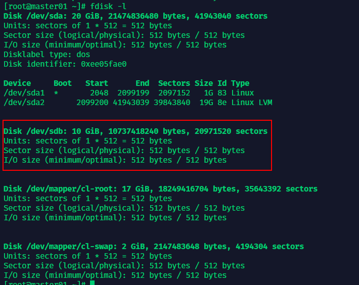
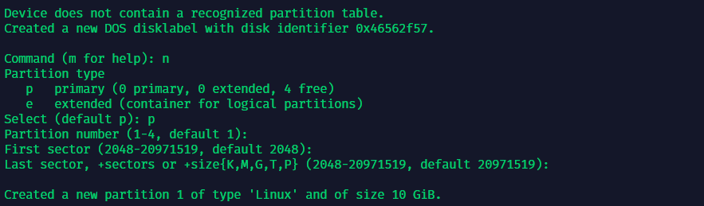
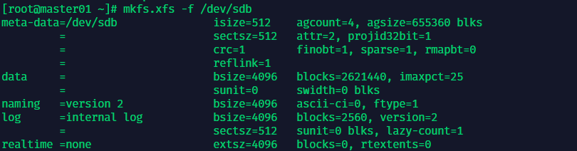
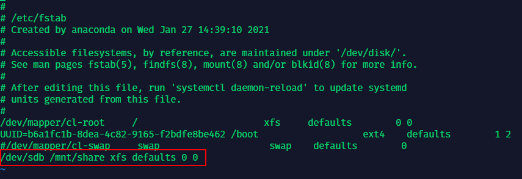
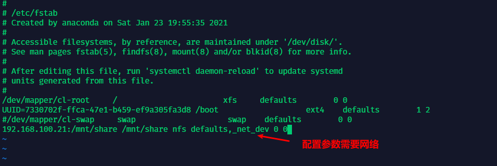

##   挂载磁盘并设置共享目录

###  新建并挂载磁盘

### 给服务器新增一块硬盘

```
fdisk -l
lsblk
```



### 给共享硬盘分区，全部默认保存 

```
fdisk  /dev/sdb
```



### 格式化新分区

```mkfs.xfs  -f   /dev/sdb```



### 开启默认挂载磁盘

```
vi /etc/fstab
```



### 挂载

```mount -a
mount -a
```

### 查看挂载状态


## 设置共享目录

### 安装相工具关包

```
yum -y install nfs-utils rpcbind
systemctl enable rpcbind nfs-server
```

## 修改配置文件

```
vi /etc/exports
/mnt/share 192.168.100.21/255.255.255.0(rw,no_root_squash,no_all_squash,sync)
```

## 启动并查看共享目录

```
#启动服务
exportfs -rv
systemctl enable rpcbind nfs-server
systemctl start nfs-server rpcbind
rpcinfo -p
#查看共享目录
showmount -e
```

##  挂载并使用共享目录

### 手动挂载共享目录到本地

```
mount 192.168.100.21:/mnt/share /mnt/share
```

### 查看挂载状态


### 设置自动挂载共享目录

```
vi /etc/fastab
```



### 挂载

```
mount -a
```


