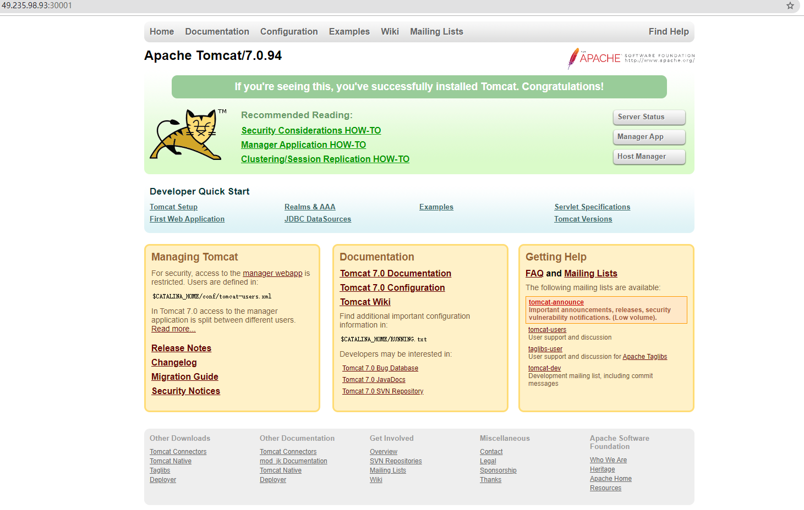

## Kubernetes概述

### Kubernetes介绍

#### Kubernetes是什么及作用

Kubernetes(K8S)是Google在2014年发布的一个开源项目，用于自动化容器化应用程序的部署、扩展和管理。 Kubernetes通常结合docker容器工作，并且整合多个运行着docker容器的主机集群。 官网地址 https://Kubernetes.io

中文社区 https://www.kubernetes.org.cn/docs

Kubernetes的目标是让部署容器化的应用简单并且高效，Kubernetes一个核心特点就是能够自主的管理容器来保 证云平台中的容器按照用户的期望运行。以下是Kubernetes相关特性： 

- 自动包装 

  根据资源需求和其他约束自动放置容器，同时不会牺牲可用性，混合关键和最大努力的工作负载，以提高资 源利用率并节省更多资源。 

- 横向缩放 

  使用简单的命令或 UI，或者根据 CPU 的使用情况自动调整应用程序副本数。 

- 自动部署和回滚

  Kubernetes 逐渐部署对应用程序或其配置的更改，同时监视应用程序运行状况，以确保它不会同时终止所有 实例。 如果出现问题，Kubernetes会为您恢复更改，利用日益增长的部署解决方案的生态系统。

-  存储编排 

  自动安装您所选择的存储系统，无论是本地存储，如公有云提供商 GCP 或 AWS, 还是网络存储系统 NFS, iSCSI, Gluster, Ceph, Cinder, 或 Flocker。 

- 自我修复 

  重新启动失败的容器，在节点不可用时，替换和重新编排节点上的容器，终止不对用户定义的健康检查做出 响应的容器，并且不会在客户端准备投放之前将其通告给客户端。 

- 服务发现和负载均衡 

  不需要修改您的应用程序来使用不熟悉的服务发现机制，Kubernetes 为容器提供了自己的 IP 地址和一组容 器的单个 DNS 名称，并可以在它们之间进行负载均衡。 

- 密钥和配置管理 

  部署和更新密钥和应用程序配置，不会重新编译您的镜像，不会在堆栈配置中暴露密钥(secrets)。

- 批处理 

  除了服务之外，Kubernetes还可以管理您的批处理和 CI 工作负载，如果需要，替换出现故障的容器。

####  使用Kubernetes能做什么

Kubernetes是一个全新的基于容器技术的分布式架构领先方案（源于Brog，是google十几年经验的结晶）； Kubernetes是一个开放的开发平台（无侵入性，现有系统很容器迁移到Kubernetes上）；Kubernetes是一个完备 的分布式系统支撑平台（完善的集群管理能力）。 

使用Kubernetes可以在物理或虚拟机的Kubernetes集群上运行容器化应用，Kubernetes能够提供一个以容器为中 心的基础架构，满足在生产环境中运行应用的一些常见需求，如:

- 多个进程协同工作
- 存储系统挂载
- Distributing secrets
- 应用健康检测
- 应用实例的复制
- Pod自动伸缩/扩展
- Naming and discovering
- 负载均衡
- 滚动更新
- 资源监控
- 日志访问
- 调度应用程序
- 提供认证和授权

#### 为什么使用Kubernetes

使用Kubernetes最直接的感受就是我们可以轻装上阵的开发复杂的系统了；其次Kubernetes是在全面拥抱微服务 架构（微服务的核心就是将一个巨大的单体应用拆分成很多小的互相连接的微服务，一个微服务后面可能是多个实 例副本在支撑，副本数量可以随着系统负荷的变化而动态调整）；最后Kubernetes系统架构具备超强的横向扩展 能力。

### Kubernetes快速入门 

- 环境准备 

  **关闭CentOS防火墙** 

  `systemctl disable firewalld `

  `systemctl stop firewalld `

  **安装etcd和kubernetes软件** 

  `yum install -y etcd kubernetes `

  **启动服务** 

  ```
  systemctl start etcd
  systemctl start docker
  systemctl start kube-apiserver
  systemctl start kube-controller-manager
  systemctl start kube-scheduler
  systemctl start kubelet
  systemctl start kube-proxy
  ```

- 配置（tomcat）

  - mytomcat.rc.yaml

      ```
    apiVersion: v1
    kind: ReplicationController
    metadata:
     name: mytomcat
    spec:
     replicas: 2
     selector:
      app: mytomcat
     template:
      metadata:
       labels:
        app: mytomcat
      spec:
       containers:
        - name: mytomcat
          image: tomcat:7-jre7
          ports:
          - containerPort: 8080
    ```

  - mytomcat.svc.yaml

    ```
    appVersion: v1
    kind: Service
    metadata:
     name: mytomcat
    spec:
     type: NodePort
     ports:
      - port: 8080
        nodePort: 30001
     selector:
      app: mytomcat
    ```

  - 创建

    ```
    kubectl create -f mytomcat.rc.yaml
    kubectl create -f mytomcat.svc.yaml
    ```

  - 浏览测试

    `http://服务器地址:30001`
    
    

### Kubernetes 基本架构与常用术语

Kubernetes集群包含有节点代理kubelet和Master组件(APIs, scheduler, etc)，一切都基于分布式的存储系统。下 面这张图是Kubernetes的架构图。


在这张系统架构图中，我们把服务分为运行在工作节点上的服务和组成集群级别控制板的服务。

Kubernetes节点有运行应用容器必备的服务，而这些都是受Master的控制。 

每次个节点上当然都要运行Docker。Docker来负责所有具体的映像下载和容器运行。 

Kubernetes主要由以下几个核心组件组成：

- etcd保存了整个集群的状态；
- apiserver提供了资源操作的唯一入口，并提供认证、授权、访问控制、API注册和发现等机制；
- controller manager负责维护集群的状态，比如故障检测、自动扩展、滚动更新等；
- scheduler负责资源的调度，按照预定的调度策略将Pod调度到相应的机器上；
- kubelet负责维护容器的生命周期，同时也负责Volume（CVI）和网络（CNI）的管理；
- Container runtime负责镜像管理以及Pod和容器的真正运行（CRI）；
- kube-proxy负责为Service提供cluster内部的服务发现和负载均衡；

除了核心组件，还有一些推荐的Add-ons：

- kube-dns负责为整个集群提供DNS服务 
- Ingress Controller为服务提供外网入口 
- Heapster提供资源监控
- Dashboard提供GUI 
- Federation提供跨可用区的集群 
- Fluentd-elasticsearch提供集群日志采集、存储与查询

Kubernetes设计理念和功能其实就是一个类似Linux的分层架构

- 核心层：Kubernetes最核心的功能，对外提供API构建高层的应用，对内提供插件式应用执行环境

- 应用层：部署（无状态应用、有状态应用、批处理任务、集群应用等）和路由（服务发现、DNS解析等） 

- 管理层：系统度量（如基础设施、容器和网络的度量），自动化（如自动扩展、动态Provision等）以及策略管理（RBAC、Quota、PSP、NetworkPolicy等） 

- 接口层：kubectl命令行工具、客户端SDK以及集群联邦 

- 生态系统：在接口层之上的庞大容器集群管理调度的生态系统，可以划分为两个范畴 

  - Kubernetes外部：日志、监控、配置管理、CI、CD、Workflow、FaaS、OTS应用、ChatOps等 

  - Kubernetes内部：CRI、CNI、CVI、镜像仓库、Cloud Provider、集群自身的配置和管理等

#### Cluster

Cluster是计算、存储和网络资源的集合，Kubernetes利用这些资源运行各种基于容器的应用. Kubernetes Cluster由Master和Node组成，节点上运行着若干Kubernetes服务

#### Master

Master主要职责是调度，即决定将应用放在哪运行。Master运行Linux系统，可以是物理机或虚拟机。 Master是 Kubernetes Cluster的大脑，运行着的Daemon服务包括kube-apiserver、kube-scheduler、kuber-controllermanager、etcd和Pod网络

- API Server(kube-apiserver)

  API Server 提供HTTP/HTTPS RESTful API,即Kubernetes API.是Kubernetes里所有资源的CRUD等操作的唯 一入口，也是集群控制的入口进程

- Scheduler(kube-scheduler)

  Scheduler负责资源调度的里程，简单说，它决定将Pod放在哪个Node上运行

- Controller Manager(kube-controller-manager)

  所有资源对象的自动化控制中心。Controller Manager负责管理Cluster各种资源，保证资源处于预期的状 态。Controller Manager有多种，如replication controller、endpoints controller、namespace controller、serviceaccounts controller等。 不同的controller管理不同的资源，如replication controller管理Deployment、StatefulSet、DaemonSet的 生命周期，namespace controller管理Namespace资源

- etcd

  etcd负责保存Kubernetes Cluster的配置信息和各种资源的状态信息。当数据发生变化时，etcd会快速地通知 Kubernetes相关组件

- Pod网络

  Pod要能够相互通信，Kubernetes Cluster必须部署Pod网络，flannel是其中一个可选方案。

#### Node

除了Master，Kubernetes集群中的其它机器被称为Node节点。Node职责是运行容器应用，Node由Master管 理，Node负责监控并汇报容器的状态，同时根据Master的要求管理容器的生命周期。Node也运行在Linux系统， 可以是物理机或虚拟机。 每个Node节点上都运行着以下一组关键进程

- kubelet 

  负责Pod对应的容器的创建、启动等任务，同时与Master节点密切协作，实现集群管理的基本功能 

- kube-proxy 

  实现Kubernetes Service的通信与负载均衡机制的重要组件 

- Docker Enginer 

  Docker引擎，负责本机的容器创建和管理工作

####  Pod

Pod是Kubernetes的最小单元，也是最重要和最基本的概念。每一个Pod包含一个或多个容器，Pod的容器会作为 一个整体被Master调度到一个Node上运行。Kubenetes为每个Pod都分配了唯一的IP地址，称为PodIP,一个Pod里的多个容器共享PodIP地址。在Kubernetes里，一个Pod里的容器与另外主机上的Pod容器能够直接通信。

#### Service

Kubernetes Service定义了外界访问一组特定Pod的方式，Service有自己的IP和端口，Service为Pod提供了负载均 衡。它也是Kubernetes最核心的资源对象之一，每个Service其实就是我们经常提起的微服务架构中的一个"微服务"。

#### Replication Controller

Replication Controller(简称RC)是Kubernetes系统中的核心概念之一，它其实是定义了一个期望的场景，即声明 某种Pod的副本数量在任意时刻都符合某个预期值，所以RC的定义包括如下几个部分

- Pod期待的副本数(replicas) 
- 用于筛选目标Pod的Label Selector 
- 当Pod的副本数量小于预期数量时，用于创建新Pod的Pod模板(template)

以下是总结的RC的一些特性与作用

在大多数情况下，我们通过定义一个RC实现Pod的创建过程及副本数量的自动控制 

- RC里包括完整的Pod定义模板 
- RC通过Label Selector机制实现对Pod副本的自动控制 
- 通过改变RC里的Pod副本数量，可以实现Pod的扩容或缩容功能 
- 通过改变RC里Pod模板中镜像版本，可以实现Pod的滚动升级功能

## Kubernetes集群

Kubernetes用于协调高度可用的计算机集群，这些计算机群集被连接作为单个单元工作。Kubernetes在一个集群上以更有效的方式自动分发和调度容器应用程序。Kubernetes集群由两种类型的资源组成： 

- Master是集群的调度节点 
- Nodes是应用程序实际运行的工作节点 

接下来为大家讲解一下如何快速部署一套Kubernetes集群，K8S集群部署有几种方式：kubeadm、minikube和二进制包。前两者属于自动部署，简化部署操作，我们这里强烈推荐初学者使用二进制包部署，因为自动部署屏蔽了很多细节，使得对各个模块感知很少，非常不利用学习。

### 环境准备与规划

- 推荐配置2核2G

  Docker version 17.05.0-ce

  | 角色   | IP              | 主键                                                         |
  | ------ | --------------- | ------------------------------------------------------------ |
  | master | 192.168.126.140 | etcd、kube-apiserver、kube-controller-manager、 kubescheduler、docker |
  | node01 | 192.168.126.141 | kube-proxy、kubelet、docker                                  |
  | node02 | 192.168.126.142 | kube-proxy、kubelet、docker                                  |

- 查看默认防火墙状态(关闭后显示not running ,开启后显示 running)

  ```
  firewall-cmd --state
  ```

- 关闭防火墙 

  ```
  systemctl stop firewalld.service
  ```

- 禁止firewall开机启动 

  ```
  systemctl disable firewalld.service
  ```

- 获取Kubernetes二进制包 

  https://github.com/kubernetes/kubernetes/blob/master/CHANGELOG-1.9.md

  

  页面表格中找到Server Binaries中的kubernetes-server-linux-amd64.tar.gz文件，下载到本地。 

  该压缩包中包括了k8s需要运行的全部服务程序文件

### Master安装

#### Docker安装

- 设置yum源

  ```
  vi /etc/yum.repos.d/docker.repo
  [dockerrepo]
  name=Docker Repository
  baseurl=https://yum.dockerproject.org/repo/main/centos/$releasever/
  enabled=1
  gpgcheck=1
  gpgkey=https://yum.dockerproject.org/gpg
  ```

- 安装docke

  ```
  yum install docker-engine
  ```

- 安装后查看docker版本

  ```
  docker -v
  ```

#### etcd服务

etcd做为Kubernetes集群的主要服务，在安装Kubernetes各服务前需要首先安装和启动。

- 下载etcd二进制文件

   https://github.com/etcd-io/etcd/releases 

  

- 上传到master并解压

  将etcd和etcdctl文件复制到/usr/bin目录

  配置systemd服务文件 /usr/lib/systemd/system/etcd.service

  ```
  [Unit]
  Description=Etcd Server
  After=network.target
  [Service]
  Type=simple
  EnvironmentFile=-/etc/etcd/etcd.conf
  WorkingDirectory=/var/lib/etcd/
  ExecStart=/usr/bin/etcd
  Restart=on-failure
  [Install]
  WantedBy=multi-user.target
  ```
  
- 启动与测试etcd服务

  ```
  systemctl daemon-reload
  systemctl enable etcd.service
  mkdir -p /var/lib/etcd/
  systemctl start etcd.service
  etcdctl cluster-health
  ```

#### kube-apiserver服务

```
cp kube-apiserver kube-controller-manager kube-scheduler kubectl /usr/bin/
```

下面是对kube-apiserver服务进行配置 

编辑systemd服务文件 vi /usr/lib/systemd/system/kube-apiserver.service

```
[Unit]
Description=Kubernetes API Server
Documentation=https://github.com/kubernetes/kubernetes
After=etcd.service
Wants=etcd.service
[Service]
EnvironmentFile=/etc/kubernetes/apiserver
ExecStart=/usr/bin/kube-apiserver $KUBE_API_ARGS
Restart=on-failure
Type=notify
[Install]
WantedBy=multi-user.target
```

创建目录： mkdir /etc/kubernetes

配置文件 ：vi /etc/kubernetes/apiserver

```
KUBE_API_ARGS="--storage-backend=etcd3 --etcd-servers=http://127.0.0.1:2379 --insecure-bind-address=0.0.0.0 --insecure-port=8080 --service-cluster-ip-range=169.169.0.0/16 --admission_control=NamespaceLifecycle,NamespaceExists,LimitRanger,SecurityContextDeny,ServiceAccount,ResourceQuota --logtostderr=true --log-dir=/var/log/kubernetes --v=2"
```

#### kube-controller-manager服务

kube-controller-manager服务依赖于kube-apiserver服务：

 配置systemd服务文件：vi /usr/lib/systemd/system/kube-controller-manager.service

```
[Unit]
Description=Kubernetes Controller Manager
Documentation=https://github.com/GoogleCloudPlatform/kubernetes
After=kube-apiserver.service
Requires=kube-apiserver.service
[Service]
EnvironmentFile=-/etc/kubernetes/controller-manager
ExecStart=/usr/bin/kube-controller-manager $KUBE_CONTROLLER_MANAGER_ARGS
Restart=on-failure
LimitNOFILE=65536
[Install]
WantedBy=multi-user.target
```

配置文件： vi /etc/kubernetes/controller-manager

```
KUBE_CONTROLLER_MANAGER_ARGS="--master=http://192.168.126.140:8080 --logtostderr=true --log-dir=/var/log/kubernetes --v=2"
```

#### kube-scheduler服务

kube-scheduler服务也依赖于kube-apiserver服务。

配置systemd服务文件：vi /usr/lib/systemd/system/kube-scheduler.service

```
[Unit]
Description=Kubernetes Scheduler
Documentation=https://github.com/GoogleCloudPlatform/kubernetes
After=kube-apiserver.service
Requires=kube-apiserver.service
[Service]
EnvironmentFile=-/etc/kubernetes/scheduler
ExecStart=/usr/bin/kube-scheduler $KUBE_SCHEDULER_ARGS
Restart=on-failure
LimitNOFILE=65536
[Install]
WantedBy=multi-user.target
```

配置文件：vi /etc/kubernetes/scheduler

```
KUBE_SCHEDULER_ARGS="--master=http://192.168.126.140:8080 --logtostderr=true --log-dir=/var/log/kubernetes --v=2"
```

#### 启动

完成以上配置后，按顺序启动服务

```
systemctl daemon-reload
systemctl enable kube-apiserver.service
systemctl start kube-apiserver.service
systemctl enable kube-controller-manager.service
systemctl start kube-controller-manager.service
systemctl enable kube-scheduler.service
systemctl start kube-scheduler.service
```

检查每个服务的健康状态：

```
systemctl status kube-apiserver.service
systemctl status kube-controller-manager.service
systemctl status kube-scheduler.service
```

### Node1安装

在Node1节点上，以同样的方式把从压缩包中解压出的二进制文件kubelet kube-proxy放到/usr/bin目录中。 

在Node1节点上需要预先安装docker,请参考Master上Docker的安装，并启动Docker

#### kubelet服务

配置systemd服务文件：vi /usr/lib/systemd/system/kubelet.service

```
[Unit]
Description=Kubernetes Kubelet Server
Documentation=https://github.com/GoogleCloudPlatform/kubernetes
After=docker.service
Requires=docker.service
[Service]
WorkingDirectory=/var/lib/kubelet
EnvironmentFile=-/etc/kubernetes/kubelet
ExecStart=/usr/bin/kubelet $KUBELET_ARGS
Restart=on-failure
KillMode=process
[Install]
WantedBy=multi-user.target
```

创建目录：mkdir -p /var/lib/kubelet

配置文件：vi /etc/kubernetes/kubelet

```
KUBELET_ARGS="--kubeconfig=/etc/kubernetes/kubeconfig --hostname-override=192.168.126.141 --logtostderr=false --log-dir=/var/log/kubernetes --v=2 --fail-swap-on=false"
```

用于kubelet连接Master Apiserver的配置文件：vi /etc/kubernetes/kubeconfig

```
apiVersion: v1
kind: Config
clusters:
 - cluster:
     server: http://192.168.126.140:8080
   name: local
contexts:
  - context:
      cluster: local
    name: mycontext
current-context: mycontext
```

#### kube-proxy服务

kube-proxy服务依赖于network服务,所以一定要保证network服务正常，如果network服务启动失败，常见解决方案有以下几中：

1. 和 NetworkManager 服务有冲突，这个好解决，直接关闭 NetworkManger 服务就好了， service NetworkManager stop，并且禁止开机启动 chkconfig NetworkManager off 。之后重启就好了 
2. 和配置文件的MAC地址不匹配，这个也好解决，使用ip addr（或ifconfig）查看mac地址， 将/etc/sysconfig/network-scripts/ifcfg-xxx中的HWADDR改为查看到的mac地址 
3. 设定开机启动一个名为NetworkManager-wait-online服务，命令为： systemctl enable NetworkManager-wait-online.service 
4. 查看/etc/sysconfig/network-scripts下，将其余无关的网卡位置文件全删掉，避免不必要的影响，即只留一个以 ifcfg开头的文件

配置systemd服务文件：vi /usr/lib/systemd/system/kube-proxy.service

```
[Unit]
Description=Kubernetes Kube-proxy Server
Documentation=https://github.com/GoogleCloudPlatform/kubernetes
After=network.service
Requires=network.service
[Service]
EnvironmentFile=/etc/kubernetes/proxy
ExecStart=/usr/bin/kube-proxy $KUBE_PROXY_ARGS
Restart=on-failure
LimitNOFILE=65536
KillMode=process
[Install]
WantedBy=multi-user.target
```

配置文件：vi /etc/kubernetes/proxy

```
KUBE_PROXY_ARGS="--master=http://192.168.100.10:8080 --hostname-override=192.168.126.141 --logtostderr=true --log-dir=/var/log/kubernetes --v=2"
```

#### 启动

```
systemctl daemon-reload
systemctl enable kubelet
systemctl start kubelet
systemctl status kubelet
systemctl enable kube-proxy
systemctl start kube-proxy
systemctl status kube-proxy
```

### Node2安装

请参考Node1安装，注意修改IP

### 健康检查与示例测试

- 查看集群状态


- 查看master集群组件状态

  

- nginx-rc.yaml

  ```
  apiVersion: v1
  kind: ReplicationController
  metadata:
   name: nginx
  spec:
   replicas: 3
   selector:
    app: nginx
   template:
    metadata:
     labels:
      app: nginx
    spec:
     containers:
     - name: nginx
       image: nginx
       ports:
       - containerPort: 80     
  ```

  kubectl create -f nginx-rc.yaml

- nginx-svc.yaml

  ```
  apiVersion: v1
  kind: Service
  metadata:
   name: nginx
  spec:
   type: NodePort
   ports:
    - port: 80
      nodePort: 30000
   selector:
     app: nginx
  ```

  kubectl create -f nginx-svc.yaml

- 查看pod

  

- 查看具体pod详情
- 

## Kubernetes核心技术

### Pod详解

Pod是Kubernetes的最重要概念，每一个Pod都有一个特殊的被称为”根容器“的Pause容器。Pause容器对应的镜 像属于Kubernetes平台的一部分，除了Pause容器，每个Pod还包含一个或多个紧密相关的用户业务容器。


- Pod vs 应用 

  每个Pod都是应用的一个实例，有专用的IP 

- Pod vs 容器 

  一个Pod可以有多个容器，彼此间共享网络和存储资源，每个Pod 中有一个Pause容器保存所有的容器状态， 
   通过管理pause容器，达到管理pod中所有容器的效果 

- Pod vs 节点

  同一个Pod中的容器总会被调度到相同Node节点，不同节点间Pod的通信基于虚拟二层网络技术实现 

- Pod vs Pod

  普通的Pod和静态Pod

#### Pod的定义

下面是yaml文件定义的Pod的完整内容

```
apiVersion: v1            //版本 
kind: Pod                 //类型，pod 
metadata:                 //元数据 
  name: string            //元数据，pod的名字 
  namespace: string       //元数据，pod的命名空间   
  labels:                 //元数据，标签列表 
    - name: string        //元数据，标签的名字 
  annotations:            //元数据,自定义注解列表     
    - name: string        //元数据,自定义注解名字 
spec:                     //pod中容器的详细定义
  containers:             //pod中的容器列表，可以有多个容器 
  - name: string          //容器的名称 
    image: string         //容器中的镜像 
    imagesPullPolicy: [Always|Never|IfNotPresent]//获取镜像的策略，默认值为Always，每次都尝试重新下 载镜像
    command: [string]     //容器的启动命令列表（不配置的话使用镜像内部的命令） 
    args: [string]        //启动参数列表 
    workingDir: string    //容器的工作目录 
    volumeMounts:         //挂载到到容器内部的存储卷设置 
    - name: string 
      mountPath: string   //存储卷在容器内部Mount的绝对路径 
      readOnly: boolean   //默认值为读写
    ports:                //容器需要暴露的端口号列表 
    - name: string 
      containerPort: int  //容器要暴露的端口 
      hostPort: int     //容器所在主机监听的端口（容器暴露端口映射到宿主机的端口，设置hostPort时同一 台宿主机将不能再启动该容器的第2份副本） 
      protocol: string    //TCP和UDP，默认值为TCP 
    env:                  //容器运行前要设置的环境列表 
    - name: string 
      value: string 
    resources:             
      limits:             //资源限制，容器的最大可用资源数量 
        cpu: Srting 
        memory: string 
      requeste:           //资源限制，容器启动的初始可用资源数量 
        cpu: string 
        memory: string 
    livenessProbe:         //pod内容器健康检查的设置 
      exec: 
        command: [string]  //exec方式需要指定的命令或脚本 
      httpGet:             //通过httpget检查健康 
        path: string 
        port: number 
        host: string 
        scheme: Srtring 
        httpHeaders: 
        - name: Stirng 
          value: string 
      tcpSocket:           //通过tcpSocket检查健康 
        port: number 
      initialDelaySeconds: 0//首次检查时间 
      timeoutSeconds: 0     //检查超时时间 
      periodSeconds: 0      //检查间隔时间 
      successThreshold: 0 
      failureThreshold: 0 
      securityContext:      //安全配置 
        privileged: falae
    restartPolicy: [Always|Never|OnFailure]//重启策略，默认值为Always 
    nodeSelector: object    //节点选择，表示将该Pod调度到包含这些label的Node上，以key:value格式指定           	
    imagePullSecrets: 
    - name: string
    hostNetwork: false      //是否使用主机网络模式，弃用Docker网桥，默认否
  volumes:                  //在该pod上定义共享存储卷列表 
  - name: string 
    emptyDir: {}            //是一种与Pod同生命周期的存储卷，是一个临时目录，内容为空     
    hostPath:               //Pod所在主机上的目录，将被用于容器中mount的目录 
      path: string 
    secret:                 //类型为secret的存储卷 
      secretName: string 
      item: 
      - key: string 
        path: string 
    configMap:             //类型为configMap的存储卷 
      name: string 
      items: 
      - key: string 
        path: string 
```

#### 3.1.2 Pod的基本用法

在kubernetes中对运行容器的要求为：容器的主程序需要一直在前台运行，而不是后台运行。应用需要改造成前台运行的方式。如果我们创建的Docker镜像的启动命令是后台执行程序，则在kubelet创建包含这个容器的pod之后运行完该命令，即认为Pod已经结束，将立刻销毁该Pod。如果为该Pod定义了RC，则创建、销毁会陷入一个无限循环的过程中。

Pod可以由1个或多个容器组合而成。

- 由一个容器组成的Pod示例

  ```
  # 一个容器组成的Pod
  apiVersion: v1
  kind: Pod
  metadata:
    name: mytomcat
    labels:
      name: mytomcat
  spec:
    containers:
    - name: mytomcat
      image: tomcat
      ports:
      - containerPort: 8000
  ```

- 由两个为紧耦合的容器组成的Pod示例

  ```
  #两个紧密耦合的容器
  apiVersion: v1
  kind: Pod
  metadata:
    name: myweb
    labels:
      name: tomcat-redis
  spec:
    containers:
    - name: tomcat
      image: tomcat
      ports:
      - containerPort: 8080
    - name: redis
      image: redis
      ports:
      - containerPort: 6379
  ```

- 创建

  `kubectl create -f xxx.yaml`

- 查看

  ```
  kubectl get pod/po <Pod_name>
  kubectl get pod/po <Pod_name> -o wide
  kubectl describe pod/po <Pod_name>
  ```

- 删除

  ```
  kubectl delete -f pod pod_name.yaml
  kubectl delete pod --all/[pod_name]
  ```

#### 3.1.3 Pod的分类

Pod有两种类型 

- 普通Pod

  普通Pod一旦被创建，就会被放入到etcd中存储，随后会被Kubernetes Master调度到某个具体的Node上并 进行绑定，随后该Pod对应的Node上的kubelet进程实例化成一组相关的Docker容器并启动起来。在默认情 况下，当Pod里某个容器停止时，Kubernetes会自动检测到这个问题并且重新启动这个Pod里某所有容器， 如果Pod所在的Node宕机，则会将这个Node上的所有Pod重新调度到其它节点上。

- 静态Pod

  静态Pod是由kubelet进行管理的仅存在于特定Node上的Pod,它们不能通过 API Server进行管理，无法与 ReplicationController、Deployment或DaemonSet进行关联，并且kubelet也无法对它们进行健康检查。

#### Pod生命周期和重启策略

- Pod的状态

  | 状态值    | 说明                                                         |
  | :-------- | ------------------------------------------------------------ |
  | Pending   | API Server已经创建了该Pod,但Pod中的一个或多个容器的镜像还没有创建，包括镜像下载过程 |
  | Running   | Pod内所有容器已创建，且至少一个容器处于运行状态、正在启动状态或正在重启状态 |
  | Completed | Pod内所有容器均成功执行退出，且不会再重启                    |
  | Failed    | Pod内所有容器均已退出，但至少一个容器退出失败                |
  | Unknown   | 由于某种原因无法获取Pod状态，例如网络通信不畅                |

- Pod重启策略

  Pod的重启策略包括Always、OnFailure和Never，默认值是Always

  | 重启策略  | 说明                                                   |
  | --------- | ------------------------------------------------------ |
  | Always    | 当容器失效时，由kubelet自动重启该容器                  |
  | OnFailure | 当容器终止运行且退出码不为0时，由kubelet自动重启该容器 |
  | Never     | 不论容器运行状态如何，kubelet都不会重启该容器          |

常见状态转换

| Pod包含的容器数 | Pod当前的状态 | 发生事件        | Pod的结果状态        |                         |                     |
| --------------- | ------------- | --------------- | -------------------- | ----------------------- | ------------------- |
|                 |               |                 | RestartPolicy=Always | RestartPolicy=OnFailure | RestartPolicy=Never |
| 包含一个容器    | Running       | 容器成功退出    | Running              | Succeeded               | Succeeded           |
| 包含一个容器    | Running       | 容器失败退出    | Running              | Running                 | Failure             |
| 包含两个容器    | Running       | 1个容器失败退出 | Running              | Running                 | Running             |
| 包含两个容器    | Running       | 容器被OOM杀掉   | Running              | Running                 | Failure             |

#### Pod资源配置

每个Pod都可以对其能使用的服务器上的计算资源设置限额，Kubernetes中可以设置限额的计算资源有CPU与Memory两种，其中CPU的资源单位为CPU数量,是一个绝对值而非相对值。Memory配额也是一个绝对值，它的单位是内存字节数。

Kubernetes里，一个计算资源进行配额限定需要设定以下两个参数：

1. Requests 该资源最小申请数量，系统必须满足要求
2. Limits 该资源最大允许使用的量，不能突破，当容器试图使用超过这个量的资源时，可能会被Kubernetes Kill并重启

```
sepc
  containers:
  - name: db
	image: mysql
    resources:
      requests:
        memory: "64Mi"
        cpu: "250m"
      limits:
        memory: "128Mi"
        cpu: "500m"
```

上述代码表明MySQL容器申请最少0.25个CPU以及64MiB内存，在运行过程中容器所能使用的资源配额为0.5个 CPU以及128MiB内存。

### Label详解

Label是Kubernetes系统中另一个核心概念。一个Label是一个key=value的键值对，其中key与value由用户自己指定。Label可以附加到各种资源对象上，如Node、Pod、Service、RC，一个资源对象可以定义任意数量的Label， 同一个Label也可以被添加到任意数量的资源对象上，Label通常在资源对象定义时确定，也可以在对象创建后动态添加或删除。

Label的最常见的用法是使用metadata.labels字段，来为对象添加Label，通过spec.selector来引用对象

```
apiVersion: v1
kind: ReplicationController
metadata:
  name: nginx
spec:
  replicas: 3
  selector:
    app: nginx
  template:
	metadata:
      labels:
        app: nginx
    spec:
      containers:
      - name: nginx
        image: nginx
        ports:
        - containerPort: 80
-------------------------------------
apiVersion: v1
kind: Service
metadata:
  name: nginx
spec:
  type: NodePort
  ports:
    - port: 80
      nodePort: 3333
  selector:
    app: nginx
```

Label附加到Kubernetes集群中的各种资源对象上，目的就是对这些资源对象进行分组管理，而分组管理的核心就是Label Selector。Label与Label Selector都是不能单独定义，必须附加在一些资源对象的定义文件上，一般附加在RC和Service的资源定义文件中。

### Replication Controller详解

Replication Controller(RC)是Kubernetes系统中核心概念之一，当我们定义了一个RC并提交到Kubernetes集群中以后，Master节点上的Controller Manager组件就得到通知，定期检查系统中存活的Pod,并确保目标Pod实例的数量刚好等于RC的预期值，如果有过多或过少的Pod运行，系统就会停掉或创建一些Pod.此外我们也可以通过修改RC的副本数量，来实现Pod的动态缩放功能。

```
kubectl scale rc nginx --replicas=5
```

由于Replication Controller与Kubernetes代码中的模块Replication Controller同名，所以在Kubernetes v1.2时， 它就升级成了另外一个新的概念Replica Sets,官方解释为下一代的RC，它与RC区别是：Replica Sets支援基于集合的 Label selector,而RC只支持基于等式的Label Selector。我们很少单独使用Replica Set,它主要被Deployment这个更高层面的资源对象所使用，从而形成一整套Pod创建、删除、更新的编排机制。最好不要越过RC直接创建Pod， 因为Replication Controller会通过RC管理Pod副本，实现自动创建、补足、替换、删除Pod副本，这样就能提高应用的容灾能力，减少由于节点崩溃等意外状况造成的损失。即使应用程序只有一个Pod副本，也强烈建议使用RC来定义Pod。

###  Replica Set详解

Replica Set 跟 Replication Controller 没有本质的不同，只是名字不一样，并且 ReplicaSet 支持集合式的selector（Replication Controller 仅支持等式）。Kubernetes官方强烈建议避免直接使用Replica Set，而应该通过 Deployment来创建RS和Pod。由于Replica Set是Replication Controller的代替物，因此用法基本相同，唯一的区别在于ReplicaSet支持集合式的selector。

### Deployment详解

Deployment是Kubenetes v1.2引入的新概念，引入的目的是为了更好的解决Pod的编排问题，Deployment内部使用了Replica Set来实现。Deployment的定义与Replica Set的定义很类似，除了API声明与Kind类型有所区别：

```
apiVersion: extensions/v1beta1
kind: Deployment
metadata:
  name: frontend
spec:
  replicas: 1
  selector:
    matchLabels:
      tier: frontend
    matchExpressions:
      - {key: tier, operator: In, values: [frontend]}
  template:
    metadata:
      labels:
        app: app-demo
        tier: frontend
    spec:
      containers:
      - name: tomcat-demo
        image: tomcat
        ports:
        - containerPort: 8080
```

### Horizontal Pod Autoscaler

Horizontal Pod Autoscal(Pod横向扩容 简称HPA)与RC、Deployment一样，也属于一种Kubernetes资源对象。通过追踪分析RC控制的所有目标Pod的负载变化情况，来确定是否需要针对性地调整目标Pod的副本数，这是HPA的实现原理。

Kubernetes对Pod扩容与缩容提供了手动和自动两种模式，手动模式通过kubectl scale命令对一个Deployment/RC进行Pod副本数量的设置。自动模式则需要用户根据某个性能指标或者自定义业务指标，并指定Pod副本数量的范围，系统将自动在这个范围内根据性能指标的变化进行调整。

- 手动扩容和缩容

  ```
  kubectl scale deployment frontend --replicas 1
  ```

- 自动扩容和缩容

  HPA控制器基本Master的kube-controller-manager服务启动参数 --horizontal-pod-autoscaler-sync-period 定义的时长(默认值为30s),周期性地监测Pod的CPU使用率，并在满足条件时对RC或Deployment中的Pod副本数量进行调整，以符合用户定义的平均Pod CPU使用率。

  ```
  apiVersion: apps/v1beta1
  kind: Deployment
  metadata:
    name: nginx-deployment
  spec:
    replicas: 1
    template:
      metadata:
        name: nginx
        labels:
          app: nginx
      spec:
        containers:
        - name: nginx
          image: nginx
          resources:
            requests:
              cpu: 50m
          ports:
          - containerPort: 80
  -------------------------------
  apiVersion: v1
  kind: Service
  metadata:
   name: nginx-svc
  spec:
   type: NodePort
   ports:
    - port: 80
   selector:
     app: nginx
  -------------------------------
  apiVersion: autoscaling/v1
  kind: HorizontalPodAutoscaler
  metadata:
    name: nginx-hpa
  spec:
    scaleTargetRef:
      apiVersion: app/v1beta1
      kind: Deployment
      name: nginx-deployment
    minReplicas: 1
    maxReplicas: 10
    targetCPUUtilizationPercentage: 50
  
  ```

### Volume详解

Volume是Pod中能够被多个容器访问的共享目录。Kubernetes的Volume定义在Pod上，它被一个Pod中的多个容 器挂载到具体的文件目录下。Volume与Pod的生命周期相同，但与容器的生命周期不相关，当容器终止或重启 时，Volume中的数据也不会丢失。要使用volume，pod需要指定volume的类型和内容（ spec.volumes 字段）， 和映射到容器的位置（ spec.containers.volumeMounts 字段）。 Kubernetes支持多种类型的Volume,包括： emptyDir、hostPath、gcePersistentDisk、awsElasticBlockStore、nfs、iscsi、flocker、glusterfs、rbd、 cephfs、gitRepo、secret、persistentVolumeClaim、downwardAPI、azureFileVolume、azureDisk、 vsphereVolume、Quobyte、PortworxVolume、ScaleIO。

- emptyDir

  EmptyDir类型的volume创建于pod被调度到某个宿主机上的时候，而同一个pod内的容器都能读写EmptyDir中的同一个文件。一旦这个pod离开了这个宿主机，EmptyDir中的数据就会被永久删除。所以目前EmptyDir 类型的volume主要用作临时空间，比如Web服务器写日志或者tmp文件需要的临时目录。

  yaml示例如下：

  ```
  apiVersion: v1
  kind: Pod
  metadata:
    name: test-pd
  spec:
    containers:
    - image: docker.io/nazarpc/webserver
      name: test-container
      volumeMounts:
      - mountPath: /cache
        name: cache-volume
    volumes:
      - name: cache-volume
      emptyDir: {}
  ```

- hostPath

  HostPath属性的volume使得对应的容器能够访问当前宿主机上的指定目录。例如，需要运行一个访问 Docker系统目录的容器，那么就使用/var/lib/docker目录作为一个HostDir类型的volume；或者要在一个容器内部运行CAdvisor，那么就使用/dev/cgroups目录作为一个HostDir类型的volume。一旦这个pod离开了 这个宿主机，HostDir中的数据虽然不会被永久删除，但数据也不会随pod迁移到其他宿主机上。因此，需要注意的是，由于各个宿主机上的文件系统结构和内容并不一定完全相同，所以相同pod的HostDir可能会在不同的宿主机上表现出不同的行为。

  yaml示例如下：

  ```
  apiVersion: v1
  kind: Pod
  metadata:
    name: test-pd
  spec:
    containers:
    - image: docker.io/nazarpc/webserver
      name: test-container
      # 指定在容器中挂接路径
      volumeMounts:
      - mountPath: /test-pd
        name: test-volume
    # 指定所提供的存储卷
    volumes:
    - name: test-volume
      # 宿主机上的目录
      hostPath:
        # directory location on host
        path: /data
  ```

- nfs

  NFS类型的volume。允许一块现有的网络硬盘在同一个pod内的容器间共享。

  yaml示例如下：

  ```
  apiVersion: apps/v1 # for versions before 1.9.0 use apps/v1beta2
  kind: Deployment
  metadata:
    name: redis
  spec:
    selector:
      matchLabels:
        app: redis
    revisionHistoryLimit: 2
    template:
      metadata:
        labels:
          app: redis
      spec:
        containers:
        # 应用的镜像
        - image: redis
          name: redis
          imagePullPolicy: IfNotPresent
          # 应用的内部端口
          ports:
          - containerPort: 6379
            name: redis6379
          env:
          - name: ALLOW_EMPTY_PASSWORD
            value: "yes"
          - name: REDIS_PASSWORD
            value: "redis"
            # 持久化挂接位置，在docker中
          volumeMounts:
          - name: redis-persistent-storage
            mountPath: /data
        volumes:
        # 宿主机上的目录
        - name: redis-persistent-storage
          nfs:
            path: /k8s-nfs/redis/data
            server: 192.168.126.112
  ```

###  Namespace详解

Namespace在很多情况下用于实现多用户的资源隔离，通过将集群内部的资源对象分配到不同的Namespace中， 形成逻辑上的分组，便于不同的分组在共享使用整个集群的资源同时还能被分别管理。Kubernetes集群在启动后，会创建一个名为"default"的Namespace，如果不特别指明Namespace,则用户创建的Pod，RC，Service都将被系统创建到这个默认的名为default的Namespace中。

- Namespace创建

  ```
  apiVersion: v1
  kind: Namespace
  metadata:
    name: development
  ---------------------
  apiVersion: v1
  kind: Pod
  metadata:
    name: busybox
    namespace: development
  spec:
    containers:
    - image: busybox
      command:
        - sleep
        - "3600"
      name: busybox
  ```

- Namespace查看

  ```
  kubectl get pods --namespace=development
  ```

### Service 详解

Service是Kubernetes最核心概念，通过创建Service,可以为一组具有相同功能的容器应用提供一个统一的入口地址，并且将请求负载分发到后端的各个容器应用上。

#### Service的定义

yaml格式的Service定义文件：

```
apiVersion: v1
kind: Service
matadata:
  name: string
  namespace: string
  labels:
  - name: string
  annotations:
  - name: string
spec:
  selector: []
  type: string
  clusterIP: string
  sessionAffinity: string
  ports:
  - name: string
    protocol: string
    port: int
    targetPort: int
    nodePort: int
  status:
    loadBalancer:
      ingress:
        ip: string
        hostname: string
```

| 属性名称                             | 取值类型 | 是否必选 | 取值说明                                                     |
| ------------------------------------ | -------- | -------- | ------------------------------------------------------------ |
| version                              | string   | Required | v1                                                           |
| kind                                 | string   | Required | Service                                                      |
| metadata                             | object   | Required | 元数据                                                       |
| metadata.name                        | string   | Required | Service名称                                                  |
| metadata.namespace                   | string   | Required | 命名空间，默认为default                                      |
| metadata.labels[]                    | list     |          | 自定义标签属性列表                                           |
| metadata.annotation[]                | list     |          | 自定义注解属性列表                                           |
| spec                                 | object   | Required | 详细描述                                                     |
| spec.selector[]                      | list     | Required | Label Selector配置，将选择具有指定 Label标签的Pod作为管理范围 |
| spec.type                            | string   | Required | Service的类型，指定Service的访问方 式，默认值为ClusterIP。取值范围如 下：ClusterIP: 虚拟服务的IP，用于k8s 集群内部的pod访问，在Node上kubeproxy通过设置的Iptables规则进行转 发。NodePort：使用宿主机的端口，使 用能够访问各Node的外部客户端通过 Node的IP地址和端口就能访问服务。 LoadBalancer: 使用外接负载均衡器完成 到服务的负载分发，需要在 spec.status.loadBalancer字段指定外部 负载均衡器的IP地址，并同时定义 nodePort和clusterIP，用于公有云环 境。 |
| spec.clusterIP                       | string   |          | 虚拟服务的IP地址，当type=clusterIP 时，如果不指定，则系统进行自动分配。也可以手工指定。当 type=LoadBalancer时，则需要指定。 |
| spec.sessionAffinity                 | string   |          | 是否支持Session，可选值为ClientIP， 表示将同一个源IP地址的客户端访问请求 都转发到同一个后端Pod。默认值为空。 |
| spec.ports[]                         | list     |          | Service需要暴露的端口列表                                    |
| spec.ports[].name                    | string   |          | 端口名称                                                     |
| spec.ports[].protocol                | string   |          | 端口协议，支持TCP和UDP，默认值为 TCP                         |
| spec.ports[].port                    | int      |          | 服务监听的端口号                                             |
| spec.ports[].targetPort              | int      |          | 需要转发到后端Pod的端口号                                    |
| spec.ports[].nodePort                | int      |          | 当spec.type=NodePort时，指定映射到物理机的端口号             |
| status                               | object   |          | 当spec.type=LoadBalancer时，设置外 部负载均衡器的地址，用于公有云环境 |
| status.loadBalancer                  | object   |          | 外部负载均衡器                                               |
| status.loadBalancer.ingress          | object   |          | 外部负载均衡器                                               |
| status.loadBalancer.ingress.ip       | string   |          | 外部负载均衡器的IP地址                                       |
| status.loadBalancer.ingress.hostname | string   |          | 外部负载均衡器的主机名                                       |


#### Service的基本用法

在某些特殊环境中，应用系统需要将一个外部数据库作为后端服务进行连接，或将另一个集群或Namespace中的服务作为服务的后端，这时可以通过创建一个无Label Selector的Service来实现。

```
apiVersion: v1
kind: Service
metadata:
  name: my-service
spec:
  ports:
  - protocol: TCP
    port: 80
    targetPort: 80
-------------------
apiVersion: v1
kind: Endpoints
metadata:
  name: my-service
subsets:
- addresses:
  - IP: 10.254.74.3
  ports:
  - port: 8080
```

我们可以通过kubectl get pods -l app=mywebapp -o yaml | grep podIP来获取Pod的IP地址和端口号来访问 Tomcat服务，但是直接通过Pod的IP地址和端口访问应用服务是不可靠的，因为当Pod所在的Node发生故障时， Pod将被kubernetes重新调度到另一台Node，Pod的地址会发生改变。我们可以通过配置文件来定义Service，再 通过kubectl create来创建，这样可以通过Service地址来访问后端的Pod。

```
apiVersion: v1
kind: Service
metadata:
  name: mywebAppService
spec:
  ports:
  - port: 8081
    targetPort: 8080
  selector:
    app: mywebapp
```

##### 多端口Service

有时一个容器应用也可能需要提供多个端口的服务，那么在Service的定义中也可以相应地设置为将多个端口对应到多个应用服务。

```
apiVersion: v1
kind: Service
metadata:
  name: mywebAppService
spec:
  ports:
  - port: 8080
    targetPort: 8080
    name: web
  - port: 8005
    targetPort: 8005
    name: management
  selector:
    app: mywebapp
```

##### 3.9.2.2 外部服务Service

在某些特殊环境中，应用系统需要将一个外部数据库作为后端服务进行连接，或将另一个集群或Namespace中的 服务作为服务的后端，这时可以通过创建一个无Label Selector的Service来实现。

```
apiVersion: v1
kind: Service
metadata:
  name: my-service
spec:
  ports:
  - protocol: TCP
    port: 80
    targetPort: 80
--------------------------
apiVersion: v1
kind: Endpoints
metadata:
  name: my-service
subsets:
  - addresses:
    - IP: 10.254.74.3
    ports:
    - port: 8080
```


## 总结

### K8S架构和组件


#### Master

- Kubernetes API Server

  作为Kubernetes系统的入口，其封装了核心对象的增删改查操作，以RESTful API接口方式提供给外部客户和内部组件调用。维护的REST对象持久化到Etcd中存储。

- Kubernetes Scheduler
  为新建立的Pod进行节点(node)选择(即分配机器)，负责集群的资源调度。组件抽离，可以方便替换成其他调度器。

- Kubernetes Controller

  负责执行各种控制器，目前已经提供了很多控制器来保证Kubernetes的正常运行。

- Replication Controller

  管理维护Replication Controller，关联Replication Controller和Pod，保证Replication Controller定义的副本数量与实际运行Pod数量一致。

#### Node

- Kubelet

  负责管控容器，Kubelet会从Kubernetes API Server接收Pod的创建请求，启动和停止容器，监控容器运行状态并汇报给Kubernetes API Server。


- Kubernetes Proxy

  负责为Pod创建代理服务，Kubernetes Proxy会从Kubernetes API Server获取所有的Service信息，并根据Service的信息创建代理服务，实现Service到Pod的请求路由和转发，从而实现Kubernetes层级的虚拟转发网络。


- Docker  

  Node上需要运行容器服务

### K8S集群搭建常见问题 

### docker启动失败

如果docker启动失败，请参考(vi /etc/sysconfig/selinux 把selinux后面的改为disabled，重启 一波 机器，再重启docker就可以了)

### 解决 kubectl get pods时No resources found问题

1、vim /etc/kubernetes/apiserver

2、找到”KUBE_ADMISSION_CONTROL="- admission_control=NamespaceLifecycle,NamespaceExists,LimitRanger,SecurityContextDeny,ServiceAccount,ResourceQuota"，去掉ServiceAccount，保存退出。

3、systemctl restart kube-apiserver  重启此服务

### pull 失败

- 解决方案1

  1、yum install *rhsm* -y

  2、docker pull registry.access.redhat.com/rhel7/pod-infrastructure:latest

  如果以上两步解决问题了，那么就不需要在执行下面操作

  3、docker search pod-infrastructure

  4、docker pull docker.io/tianyebj/pod-infrastructure

  5、docker tag tianyebj/pod-infrastructure 192.168.126.143:5000/pod-infrastructure  

  6、docker push 192.168.126.143:5000/pod-infrastructure

  7、vi /etc/kubernetes/kubelet 

  修改 KUBELET_POD_INFRA_CONTAINER="--pod-infra-container-image=192.168.126.143：5000/pod-infrastructure:latest"

  8、重启服务

  systemctl restart kube-apiserver
  systemctl restart kube-controller-manager
  systemctl restart kube-scheduler
  systemctl restart kubelet
  systemctl restart kube-proxy

- 解决方案2

  1、docker pull kubernetes/pause

  2、docker tag docker.io/kubernetes/pause:latest 192.168.126.143:5000/google_containers/pause-amd64.3.0

  3、docker push 192.168.126.143:5000/google_containers/pause-amd64.3.0

  4、vi /etc/kubernetes/kubelet配置为

  ​	KUBELET_ARGS="--pod_infra_container_image=192.168.126.143:5000/google_containers/pause-amd64.3.0"

  5、重启kubelet服务   systemctl restart kubelet

  ```
  私有仓库搭建
  docker pull registry
  docker run -di --name=registry -p 5000:5000 registry
  修改daemon.json {"insecure-registries":["192.168.126.148:5000"]}
  重启docker服务 systemctl restart docker
  ```

### 解决内外可以访问外网无法访问

`curl 服务地址`

由于k8s的的iptables导致的，设置转发

`iptables -P FORWARD ACCEPT`

###  根据报错日志排查并解决集群中启动遇到的问题

如启动kubelet：systemctl start kubelet

查看kubelet状态：systemctl status kubelet

查看具体报错明细：

`journalctl -xefu kubelet` 查看systemd日志发现真正的错误原因或者查看日志文件 cat /var/messages | grep kubelet*，找到错误信息,根据具体报错信息解决。

### The connection to the server localhost:8080 was refused - did you specify the right host or port?

```
echo export KUBECONFIG=/etc/kubernetes/admin.conf >> ~/.bash_profile
source ~/.bash_profile
```

### pod状态一直pending

- 0/1 nodes are available: 1 node(s) had taints that the pod didn't tolerate.

```
允许master节点部署pod
kubectl taint nodes --all node-role.kubernetes.io/master-
如果不允许调度
kubectl taint nodes master1 node-role.kubernetes.io/master=:NoSchedule
污点可选参数
	  NoSchedule: 一定不能被调度
      PreferNoSchedule: 尽量不要调度
      NoExecute: 不仅不会调度, 还会驱逐Node上已有的Pod
```

### unexpected error getting claim reference: selfLink was empty, can't make reference

Current workaround is to edit /etc/kubernetes/manifests/kube-apiserver.yaml

Under here:

```
spec:
  containers:
  - command:
    - kube-apiserver
```

Add this line:
\- --feature-gates=RemoveSelfLink=false

The do this:

```
kubectl apply -f /etc/kubernetes/manifests/kube-apiserver.yaml
```

## 常用命令

- 获取当前命名空间下的容器

  kubectl get pods

- 获取所有容器l列表

  kubectl get  all

- 创建 容器

  kubectl create -f kubernate-pvc.yaml

- 删除容器

  kubectl delete pods/test-pd  或者 kubectl delete -f rc-nginx.yaml

- 查看指定pod跑在哪个node上

  kubectl get pod /test-pd -o wide 

- 查看容器日志

  Kubectl logs nginx-8586cf59-mwwtc

- 进入容器终端命令

  kubectl exec -it nginx-8586cf59-mwwtc /bin/bash

- 一个Pod里含有多个容器 用--container or -c 参数。

  例如:假如这里有个Pod名为my-pod,这个Pod有两个容器,分别名为main-app 和 helper-app,下面的命令将打开到main-app的shell的容器里。

  kubectl exec -it my-pod --container main-app -- /bin/bash

- 容器详情列表

  kubectl *describe* pod/mysql- m8rbl

- 查看容器状态

  kubectl get svc


## 防火墙相关

```
#查看防火墙某个端口是否开放
firewall-cmd --query-port=3306/tcp
#开放防火墙端口3306
firewall-cmd --zone=public --add-port=3306/tcp --permanent
#查看防火墙状态
systemctl status firewalld
#关闭防火墙
systemctl stop firewalld
#打开防火墙
systemctl start firewalld
#开放一段端口
firewall-cmd --zone=public --add-port=40000-45000/tcp --permanent
#查看开放的端口列表
firewall-cmd --zone=public --list-ports
```

## 安装手册

## Centos8上部署kubernetes

###  查看系统版本

```
[root@localhost]# cat /etc/centos-release
CentOS Linux release 8.1.1911 (Core)
```

### 配置网络

```
[root@localhost ~]# cat /etc/sysconfig/network-scripts/ifcfg-enp0s3
TYPE=Ethernet
PROXY_METHOD=none
BROWSER_ONLY=no
BOOTPROTO=static
DEFROUTE=yes
IPV4_FAILURE_FATAL=no
IPV6INIT=yes
IPV6_AUTOCONF=yes
IPV6_DEFROUTE=yes
IPV6_FAILURE_FATAL=no
IPV6_ADDR_GEN_MODE=stable-privacy
NAME=enp0s3
UUID=039303a5-c70d-4973-8c91-97eaa071c23d
DEVICE=enp0s3
ONBOOT=yes
IPADDR=192.168.122.21
NETMASK=255.255.255.0
GATEWAY=192.168.122.1
DNS1=223.5.5.5
```

### 添加阿里源

```
[root@localhost ~]# rm -rfv /etc/yum.repos.d/*
[root@localhost ~]# curl -o /etc/yum.repos.d/CentOS-Base.repo http://mirrors.aliyun.com/repo/Centos-8.repo
```

### 配置主机名

```
[root@master01 ~]# cat /etc/hosts
127.0.0.1   localhost localhost.localdomain localhost4 localhost4.localdomain4
::1         localhost localhost.localdomain localhost6 localhost6.localdomain6
192.168.122.21 master01.paas.com master01
```

关闭swap，注释swap分区

```
[root@master01 ~]# swapoff -a
[root@master01 ~]# cat /etc/fstab

#
# /etc/fstab
# Created by anaconda on Tue Mar 31 22:44:34 2020
#
# Accessible filesystems, by reference, are maintained under '/dev/disk/'.
# See man pages fstab(5), findfs(8), mount(8) and/or blkid(8) for more info.
#
# After editing this file, run 'systemctl daemon-reload' to update systemd
# units generated from this file.
#
/dev/mapper/cl-root     /                       xfs     defaults        0 0
UUID=5fecb240-379b-4331-ba04-f41338e81a6e /boot                   ext4    defaults        1 2
/dev/mapper/cl-home     /home                   xfs     defaults        0 0
#/dev/mapper/cl-swap     swap                    swap    defaults        0 0
```

配置内核参数，将桥接的IPv4流量传递到iptables的链

```
[root@master01 ~]# cat > /etc/sysctl.d/k8s.conf <<EOF
net.bridge.bridge-nf-call-ip6tables = 1
net.bridge.bridge-nf-call-iptables = 1
EOF
sysctl --system
```

###  安装常用包

```
[root@master01 ~]# yum install vim bash-completion net-tools gcc -y
```

### 使用aliyun源安装docker-ce

```
[root@master01 ~]# yum install -y yum-utils device-mapper-persistent-data lvm2
[root@master01 ~]# yum-config-manager --add-repo https://mirrors.aliyun.com/docker-ce/linux/centos/docker-ce.repo
[root@master01 ~]# yum -y install docker-ce
```

添加aliyundocker仓库加速器

```
[root@master01 ~]# mkdir -p /etc/docker
[root@master01 ~]# tee /etc/docker/daemon.json <<-'EOF'
{
  "registry-mirrors": ["https://fl791z1h.mirror.aliyuncs.com"]
  "exec-opts": ["native.cgroupdriver=systemd"]
}
EOF
[root@master01 ~]# systemctl daemon-reload
[root@master01 ~]# systemctl restart docker
[root@master01 ~]# systemctl enable docker
```

### 安装kubectl、kubelet、kubeadm

#### 添加阿里kubernetes源

```
[root@master01 ~]# cat <<EOF > /etc/yum.repos.d/kubernetes.repo
[kubernetes]
name=Kubernetes
baseurl=https://mirrors.aliyun.com/kubernetes/yum/repos/kubernetes-el7-x86_64/
enabled=1
gpgcheck=1
repo_gpgcheck=1
gpgkey=https://mirrors.aliyun.com/kubernetes/yum/doc/yum-key.gpg https://mirrors.aliyun.com/kubernetes/yum/doc/rpm-package-key.gpg
EOF
```

#### 安装

```
[root@master01 ~]# yum install kubectl kubelet kubeadm
[root@master01 ~]# systemctl enable kubelet
```

#### 初始化k8s集群

```
[root@master01 ~]# kubeadm init --kubernetes-version=1.18.0  \
--apiserver-advertise-address=192.168.100.7   \
--image-repository registry.aliyuncs.com/google_containers  \
--service-cidr=10.10.0.0/16 --pod-network-cidr=10.122.0.0/16
```

POD的网段为: 10.122.0.0/16， api server地址就是master本机IP。

这一步很关键，由于kubeadm 默认从官网k8s.grc.io下载所需镜像，国内无法访问，因此需要通过–image-repository指定阿里云镜像仓库地址。

记录生成的最后部分内容，此内容需要在其它节点加入Kubernetes集群时执行。
根据提示创建kubectl

```
[root@master01 ~]# mkdir -p $HOME/.kube
[root@master01 ~]# sudo cp -i /etc/kubernetes/admin.conf $HOME/.kube/config
[root@master01 ~]# sudo chown $(id -u):$(id -g) $HOME/.kube/config
```

#### 使kubectl可以自动补充

```
[root@master01 ~]# source <(kubectl completion bash)
```

查看节点，pod

```
[root@master01 ~]# kubectl get node
NAME                STATUS     ROLES    AGE     VERSION
master01.paas.com   NotReady   master   2m29s   v1.18.0
[root@master01 ~]# kubectl get pod --all-namespaces
NAMESPACE     NAME                                        READY   STATUS    RESTARTS   AGE
kube-system   coredns-7ff77c879f-fsj9l                    0/1     Pending   0          2m12s
kube-system   coredns-7ff77c879f-q5ll2                    0/1     Pending   0          2m12s
kube-system   etcd-master01.paas.com                      1/1     Running   0          2m22s
kube-system   kube-apiserver-master01.paas.com            1/1     Running   0          2m22s
kube-system   kube-controller-manager-master01.paas.com   1/1     Running   0          2m22s
kube-system   kube-proxy-th472                            1/1     Running   0          2m12s
kube-system   kube-scheduler-master01.paas.com            1/1     Running   0          2m22s
```

node节点为NotReady，因为corednspod没有启动，缺少网络pod

### 安装calico网络

```
[root@master01 ~]# kubectl apply -f https://docs.projectcalico.org/manifests/calico.yaml
configmap/calico-config created
customresourcedefinition.apiextensions.k8s.io/bgpconfigurations.crd.projectcalico.org created
customresourcedefinition.apiextensions.k8s.io/bgppeers.crd.projectcalico.org created
customresourcedefinition.apiextensions.k8s.io/blockaffinities.crd.projectcalico.org created
customresourcedefinition.apiextensions.k8s.io/clusterinformations.crd.projectcalico.org created
customresourcedefinition.apiextensions.k8s.io/felixconfigurations.crd.projectcalico.org created
customresourcedefinition.apiextensions.k8s.io/globalnetworkpolicies.crd.projectcalico.org created
customresourcedefinition.apiextensions.k8s.io/globalnetworksets.crd.projectcalico.org created
customresourcedefinition.apiextensions.k8s.io/hostendpoints.crd.projectcalico.org created
customresourcedefinition.apiextensions.k8s.io/ipamblocks.crd.projectcalico.org created
customresourcedefinition.apiextensions.k8s.io/ipamconfigs.crd.projectcalico.org created
customresourcedefinition.apiextensions.k8s.io/ipamhandles.crd.projectcalico.org created
customresourcedefinition.apiextensions.k8s.io/ippools.crd.projectcalico.org created
customresourcedefinition.apiextensions.k8s.io/networkpolicies.crd.projectcalico.org created
customresourcedefinition.apiextensions.k8s.io/networksets.crd.projectcalico.org created
clusterrole.rbac.authorization.k8s.io/calico-kube-controllers created
clusterrolebinding.rbac.authorization.k8s.io/calico-kube-controllers created
clusterrole.rbac.authorization.k8s.io/calico-node created
clusterrolebinding.rbac.authorization.k8s.io/calico-node created
daemonset.apps/calico-node created
serviceaccount/calico-node created
deployment.apps/calico-kube-controllers created
serviceaccount/calico-kube-controllers created
```

查看pod和node

```
[root@master01 ~]# kubectl get pod --all-namespaces
NAMESPACE     NAME                                        READY   STATUS    RESTARTS   AGE
kube-system   calico-kube-controllers-555fc8cc5c-k8rbk    1/1     Running   0          36s
kube-system   calico-node-5km27                           1/1     Running   0          36s
kube-system   coredns-7ff77c879f-fsj9l                    1/1     Running   0          5m22s
kube-system   coredns-7ff77c879f-q5ll2                    1/1     Running   0          5m22s
kube-system   etcd-master01.paas.com                      1/1     Running   0          5m32s
kube-system   kube-apiserver-master01.paas.com            1/1     Running   0          5m32s
kube-system   kube-controller-manager-master01.paas.com   1/1     Running   0          5m32s
kube-system   kube-proxy-th472                            1/1     Running   0          5m22s
kube-system   kube-scheduler-master01.paas.com            1/1     Running   0          5m32s
[root@master01 ~]# kubectl get node
NAME                STATUS   ROLES    AGE     VERSION
master01.paas.com   Ready    master   5m47s   v1.18.0
[root@master01 ~]#
```

### 节点加入集群

####  创建token，token有效时间24h

```
[root@k8s-master~]# kubeadm token create
c9afga.w3fue0yh3gzxczic
```

#### 查看token

```
[root@k8s-master~]# kubeadm token list
```

####  获取ca证书sha256编码hash值

```
[root@k8s-master~]# openssl x509 -pubkey -in /etc/kubernetes/pki/ca.crt | openssl rsa -pubin -outform der 2>/dev/null | openssl dgst -sha256 -hex | sed 's/^.* //'
8b79b6461e58c07333cb2851fe74fd4374af8bbbe0bf7e040b415b86ad4fb89d
```

#### 节点加入集群

```
[root@k8s-node~]# kubeadm reset
[root@k8s-node~]# kubeadm join 192.168.100.7:6443 --token c9afga.w3fue0yh3gzxczic --discovery-token-ca-cert-hash sha256:8b79b6461e58c07333cb2851fe74fd4374af8bbbe0bf7e040b415b86ad4fb89d
```

#### 节点查看

```
[root@master ~]# kubectl get nodes
NAME       STATUS   ROLES                  AGE   VERSION
master     Ready    control-plane,master   14h   v1.20.2
node       Ready    <none>                 10m   v1.20.2
```

### master加入集群

#### 设置免密登录

```
[root@master01 ~]# ssh-keygen -t rsa
[root@master01 ~]# ssh-copy-id -i /root/.ssh/id_rsa.pub root@192.168.100.9
```

#### 同步相关证书脚本

```
[root@master home]# cat scp.sh 
USER=root
CONTROL_PLANE_IPS="192.168.100.9"
for host in ${CONTROL_PLANE_IPS}; 
do
    scp /etc/kubernetes/pki/ca.crt "${USER}"@$host:
    scp /etc/kubernetes/pki/ca.key "${USER}"@$host:
    scp /etc/kubernetes/pki/sa.key "${USER}"@$host:
    scp /etc/kubernetes/pki/sa.pub "${USER}"@$host:
    scp /etc/kubernetes/pki/front-proxy-ca.crt "${USER}"@$host:
    scp /etc/kubernetes/pki/front-proxy-ca.key "${USER}"@$host:
    scp /etc/kubernetes/pki/etcd/ca.crt "${USER}"@$host:etcd-ca.crt
    scp /etc/kubernetes/pki/etcd/ca.key "${USER}"@$host:etcd-ca.key
    scp /etc/kubernetes/admin.conf "${USER}"@$host:
    ssh ${USER}@${host} 'mkdir -p /etc/kubernetes/pki/etcd'
    ssh ${USER}@${host} 'mv /${USER}/ca.crt /etc/kubernetes/pki/'
    ssh ${USER}@${host} 'mv /${USER}/ca.key /etc/kubernetes/pki/'
    ssh ${USER}@${host} 'mv /${USER}/sa.pub /etc/kubernetes/pki/'
    ssh ${USER}@${host} 'mv /${USER}/sa.key /etc/kubernetes/pki/'
    ssh ${USER}@${host} 'mv /${USER}/front-proxy-ca.crt /etc/kubernetes/pki/'
    ssh ${USER}@${host} 'mv /${USER}/front-proxy-ca.key /etc/kubernetes/pki/'
    ssh ${USER}@${host} 'mv /${USER}/etcd-ca.crt /etc/kubernetes/pki/etcd/ca.crt'
    ssh ${USER}@${host} 'mv /${USER}/etcd-ca.key /etc/kubernetes/pki/etcd/ca.key'
    ssh ${USER}@${host} 'mv /${USER}/admin.conf /etc/kubernetes/admin.conf'
done
```

#### 节点加入集群

```
[root@k8s-node~]# kubeadm reset
[root@k8s-node~]# kubeadm join 192.168.100.7:6443 --token c9afga.w3fue0yh3gzxczic --discovery-token-ca-cert-hash sha256:8b79b6461e58c07333cb2851fe74fd4374af8bbbe0bf7e040b415b86ad4fb89d --control-plane
```


## 安装Helm

###  创建权限

```
apiVersion: v1
kind: ServiceAccount
metadata:
  name: tiller
  namespace: kube-system
---
apiVersion: rbac.authorization.k8s.io/v1
kind: ClusterRoleBinding
metadata:
  name: tiller
roleRef:
  apiGroup: rbac.authorization.k8s.io
  kind: ClusterRole
  name: cluster-admin
subjects:
  - kind: ServiceAccount
    name: tiller
    namespace: kube-system
```

```
[root@k8s-node1 k8s]# kubectl apply -f helm_rbac.yaml
serviceaccount/tiller created
clusterrolebinding.rbac.authorization.k8s.io/tiller created
```

### 下载安装包并安装

```
#下载安装包 https://github.com/helm/helm/releases
wget https://get.helm.sh/helm-v2.16.3-linux-amd64.tar.gz
#解压压缩包
tar -zxvf helm-v2.16.3.tar.gz
mv helm-v2.16.3/helm /usr/local/bin/helm
mv helm-v2.16.3/tiller /usr/local/bin/tiller
#验证
helm help
初始化
helm init --service-account=tiller --tiller-image=registry.cn-hangzhou.aliyuncs.com/google_containers/tiller:v2.16.3 --history-max 300
```

###  验证 helm 或 tiller

```
kubectl -n kube-system get pods|grep tiller
```

### 检查 tiller 是否部署到 k8s

```
[root@k8s-node1 local]# kubectl get pod -n kube-system -l app=helm
NAME                             READY   STATUS    RESTARTS   AGE
tiller-deploy-7b76b656b5-m4k2x   1/1     Running   0          94s
```

### 安装openEBS

```
[root@k8s-node1 local]# kubectl create ns openebs
namespace/openebs created
```

#### 安装

```
[root@k8s-node1 local]# helm install --namespace openebs --name openebs stable/openebs --version 1.5.0
```

#### 验证等待安装完成

```
[root@master01 manifests]# kubectl get pods -n openebs
NAME                                           READY   STATUS    RESTARTS   AGE
openebs-admission-server-5dbc9f4456-vv74r      1/1     Running   0          12m
openebs-apiserver-659d656db5-fhdzn             1/1     Running   0          12m
openebs-localpv-provisioner-6cb9d78965-82fnj   1/1     Running   0          12m
openebs-ndm-2t2tm                              1/1     Running   0          12m
openebs-ndm-operator-5ff78c45f6-549tp          1/1     Running   0          12m
openebs-provisioner-77b84d8cc-rpvfz            1/1     Running   0          12m
openebs-snapshot-operator-6dcc7b6fbd-8nh82     2/2     Running   0          12m
```

#### 将 openebs-hostpath设置为默认的 StorageClass

```
[root@k8s-node1 local]# kubectl patch storageclass openebs-hostpath -p '{"metadata": {"annotations":{"storageclass.kubernetes.io/is-default-class":"true"}}}'
storageclass.storage.k8s.io/openebs-hostpath patched
[root@k8s-node1 local]# kubectl get sc
NAME                         PROVISIONER                                                RECLAIMPOLICY   VOLUMEBINDINGMODE      ALLOWVOLUMEEXPANSION   AGE
openebs-device               openebs.io/local                                           Delete          WaitForFirstConsumer   false                  7m20s
openebs-hostpath (default)   openebs.io/local                                           Delete          WaitForFirstConsumer   false                  7m20s
openebs-jiva-default         openebs.io/provisioner-iscsi                               Delete          Immediate              false                  7m21s
openebs-snapshot-promoter    volumesnapshot.external-storage.k8s.io/snapshot-promoter   Delete          Immediate              false                  7m20s
openebs-hostpath 变为 default
```

